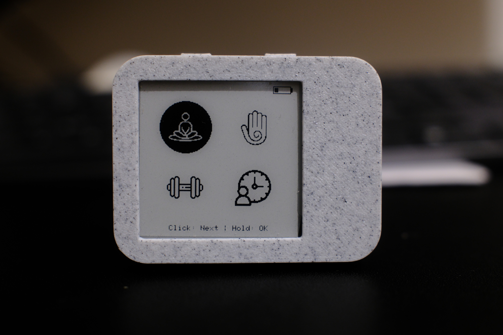

# 🧘 ESP32 Reiki Timer — LILYGO T-Wrist E-Paper

Firmware multi-modes pour accompagner tes pratiques bien-être et sportives,
conçu pour le module **LILYGO T-Wrist E-Paper 1.54"** (ESP32 + écran e-paper
200×200 + moteur vibrant intégré + 1 bouton utilisateur).



---

## ✨ Fonctionnalités

| Mode | Description |
|---|---|
| 🧘 **Méditation** | Timer compte à rebours avec alerte vibration mi-parcours optionnelle |
| 🙌 **Reiki** | Minuteur par positions avec alerte à chaque changement de position |
| 🏋️ **Sport** | Interval timer configurable (Work / Rest / Rounds) |
| 🎯 **Focus** | Pomodoro configurable (Work / Break / Sets) |

- Navigation à **un seul bouton** (Click = suivant, Long Press = valider/éditer)
- Affichage **e-paper** basse consommation, aucun rétroéclairage requis
- **Deep sleep** automatique après 60 secondes d'inactivité
- Nettoyage anti image-fantôme + image de veille à l'endormissement
- **Configuration persistante** via RTC RAM (survit au deep sleep)
- Retour **haptique** avec 5 profils de vibration distincts
- Indicateur de **batterie** affiché en permanence

---

## 🖥️ Matériel

Ce firmware est conçu **exclusivement** pour le module :

> **[LILYGO T-Wrist E-Paper 1.54" Display](https://lilygo.cc/products/t-wrist-e-paper-1-54-inch-display)**

| Caractéristique | Valeur |
|---|---|
| MCU | ESP32 (4 MB Flash) |
| Écran | E-Paper 1.54" — GxDEPG0150BN — 200×200 px — 2 niveaux de gris |
| Temps de rafraîchissement complet | ~2 secondes |
| Moteur vibrant | DC intégré |
| Connectivité | Wi-Fi 802.11 b/g/n + Bluetooth 4.2 |
| Batterie | Li-Ion via connecteur JST 1.25mm 2P |
| Programmation | Via **T-U2T** (adaptateur USB-UART, vendu séparément ou en bundle) |

### Pinout utilisé

| Signal | GPIO |
|---|---|
| Bouton utilisateur | 35 |
| Moteur vibrant (PWM) | 4 |
| Power Enable | 5 |
| ADC batterie | 34 |
| EPD — CS | 15 |
| EPD — DC | 2 |
| EPD — RESET | 17 |
| EPD — BUSY | 16 |
| SPI — SCK | 14 |
| SPI — MOSI (DIN) | 13 |

---

## 📦 Dépendances

À installer via le **Gestionnaire de bibliothèques** de l'Arduino IDE :

| Bibliothèque | Lien |
|---|---|
| GxEPD (fork lewisxhe) | [github.com/lewisxhe/GxEPD](https://github.com/lewisxhe/GxEPD) |
| AceButton | [github.com/bxparks/AceButton](https://github.com/bxparks/AceButton) |
| Adafruit GFX Library | Via gestionnaire de bibliothèques Arduino |

> ⚠️ **Important :** Utilise le **fork lewisxhe de GxEPD** (pas le dépôt principal ZinggJM).
> C'est la version requise pour compiler correctement avec le T-Wrist.
>
> Installation manuelle : **Sketch → Inclure une bibliothèque → Ajouter une bibliothèque .ZIP**

---

## 🚀 Installation

### 1. Cloner ou télécharger le projet

```bash
git clone https://github.com/TON_USERNAME/esp32-wellness-timer.git
```

Ou télécharge le ZIP depuis GitHub → **Code → Download ZIP**, puis extrais le dossier.

### 2. Configuration Arduino IDE & dépendances

Pour la configuration de l'environnement Arduino IDE (support ESP32,
bibliothèques, drivers T-U2T), suis le guide officiel LILYGO :

> 📖 **[Documentation officielle — Wrist-E-Paper](https://github.com/Xinyuan-LilyGO/Wrist-E-Paper/tree/main)**

> ⚠️ **Important :** Pour le pilote e-paper, utilise le **fork lewisxhe de GxEPD**
> (pas le dépôt principal ZinggJM) :
> [github.com/lewisxhe/GxEPD](https://github.com/lewisxhe/GxEPD)
>
> Installation manuelle : **Sketch → Inclure une bibliothèque → Ajouter une bibliothèque .ZIP**

### 3. Ouvrir le projet

Ouvre `main.ino` dans Arduino IDE.
Le fichier `images.h` doit être dans le **même dossier** que `main.ino`.

### 4. Configurer la carte

Dans **Outils**, configure comme suit :

| Paramètre | Valeur |
|---|---|
| Type de carte | ESP32 Dev Module |
| Flash Size | 4MB (32Mb) |
| Partition Scheme | Default 4MB with spiffs |
| Upload Speed | 115200 |

### 5. Flasher

1. Connecte l'adaptateur **T-U2T** au module T-Wrist, puis au PC via USB
2. Sélectionne le bon port dans **Outils → Port**
3. Clique sur **Téléverser** ▶️

---

## 🎮 Utilisation

### Navigation

| Action | Résultat |
|---|---|
| **Click court** | Élément suivant dans le menu |
| **Long Press (≥ 600 ms)** | Valider / Entrer en édition |

### Éditeur de temps

| Action | Résultat |
|---|---|
| **Click court** | Incrémenter le chiffre actif |
| **Long Press** | Passer au champ suivant |
| Sélectionner **Valider** + Long Press | Sauvegarder et revenir |

### En session

| Action | Résultat |
|---|---|
| **Long Press** | Stopper la session et revenir au menu de config |

### Patterns de vibration

| Pattern | Déclenchement |
|---|---|
| 1 coup court | Navigation / Click |
| 2 coups | Démarrage de session |
| 3 coups croissants | Changement de position Reiki |
| 2 coups forts | Fin de session |
| 3 coups répétés | Alerte mi-parcours Méditation |

---

## 🖨️ Boîtier 3D

Le boîtier est un design **original**, modélisé sur **[Onshape](https://www.onshape.com)**
spécifiquement pour le module LILYGO T-Wrist E-Paper 1.54".

Les fichiers STL sont disponibles sur **Printables** :

> 🔗 **[Télécharger le boîtier sur Printables](https://www.printables.com/model/TON_ID)**

### Paramètres d'impression recommandés

| Paramètre | Valeur |
|---|---|
| Matériau | PLA ou PETG |
| Épaisseur de couche | 0.2 mm |
| Remplissage | 20 % |
| Supports | À vérifier selon orientation |
| Périmètres | 3 |

### Photos


---

## ⚠️ Notes techniques

- La courbe batterie est **linéaire** (3.30V → 4.15V). Pour plus de précision,
  remplacer `batteryPercentFromVoltage()` par une courbe non-linéaire.
- Les icônes dans `images.h` sont des bitmaps PROGMEM 48×48 px (1 bit/pixel).
  Tu peux les régénérer avec [image2cpp](https://javl.github.io/image2cpp/).

---

## 🙏 Ressources

- [LILYGO Wrist-E-Paper — dépôt officiel](https://github.com/Xinyuan-LilyGO/Wrist-E-Paper/tree/main)
- [lewisxhe/GxEPD — fork GxEPD pour LILYGO](https://github.com/lewisxhe/GxEPD)
- [image2cpp — générateur de bitmaps PROGMEM](https://javl.github.io/image2cpp/)
- [AceButton — gestion bouton avancée](https://github.com/bxparks/AceButton)

---

## 🤖 Note sur ce README

Ce README a été généré avec l'aide de **[Perplexity AI](https://www.perplexity.ai)**.
J'ai effectué une relecture complète, mais il est possible qu'il manque des détails
ou que certaines informations méritent d'être précisées.

Si tu remarques quelque chose d'incorrect ou d'incomplet, n'hésite pas à me le faire savoir —
toute contribution est la bienvenue ! 🙏

> 📬 **Contact :** [Ouvrir une issue](https://github.com/TON_USERNAME/esp32-wellness-timer/issues)

## 📄 Licence

MIT — Libre d'utilisation, modification et redistribution.
Voir le fichier [LICENSE](LICENSE).
